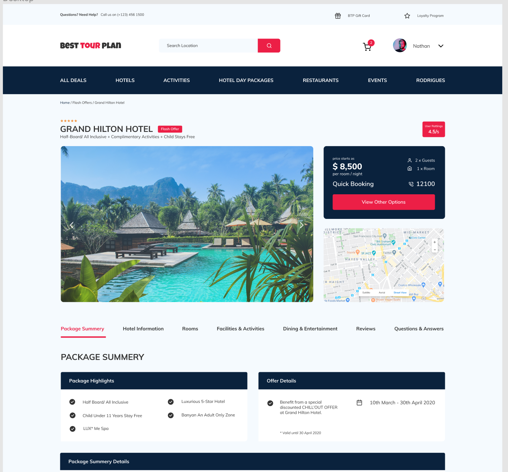

Create a Landing Page using the attached mockup file.
===============================

## Download here the [Figma Mockup](./Hotel_Booking_Freebie.fig)

Requirements:
----------------
- Create the Landing Page for Desktop view
- Respect exactly the provided layout
- Deploy the project towards Netlify (www.netlify.com) connected to your GitHub Repo
- The page should have an efficient SEO level
- Write CSS following BEM Methodology
- After the project is deployed, analyze it with https://web.dev

Knowledge Required for the Project:
----------------
- Basic HTML
- CSS Flexbox
- BEM Methodology
- SVG integration
- Rounded Images
- External Fonts integration
- Figma Usage
- SEO rules and Metatags

